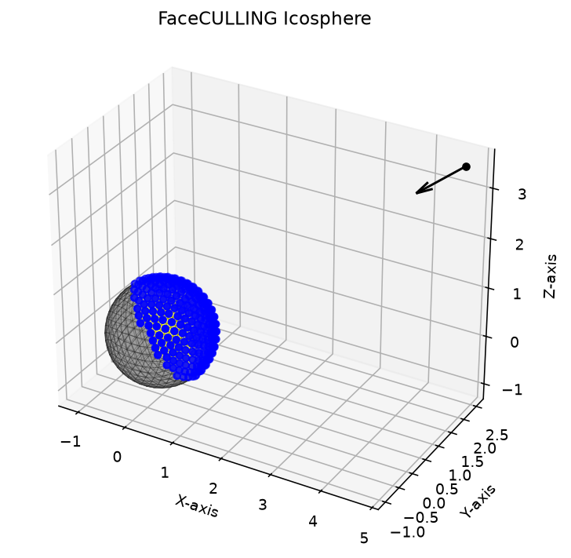

# geo3dcull

[](LICENSE)

> ⚠️ **Work in progress.** Research-grade code, build- and correctness-verified
> on CPU (OpenMP) and real CUDA GPU hardware, but not yet independently
> reviewed or hardened for production. See
> [Disclaimer & TODO](#disclaimer--work-in-progress).

**GPU/CPU-accelerated 3D mesh visibility culling** — a self-contained toolkit that
computes which faces and vertices of a triangular mesh are visible from a
point-wise camera, with support for occlusion testing and boundary relaxation.

The core culling is implemented in C++ (OpenMP) with an optional CUDA (GPU)
backend, exposed to Python through a clean `ctypes` wrapper that ships in this
repository. Clone, build, and run — no external services or special environments
required.



*Figure generated directly from the library's own test/demo helper
(`Geo3DCullDLL.runTest`) — see `docs/generate_figure.py`.*

```
┌────────────┐   ctypes    ┌─────────────────────────────┐
│  Python    │ ──────────► │  CPU: Geo3DCullLib (OpenMP)  │
│  wrapper   │             │  GPU: Geo3DCullLibCuda (CUDA)│
│ (main API) │             └─────────────────────────────┘
└────────────┘                     ▲
                                    │ compiled from source
                              src/  cuda/
```

---

## Features

- **Two interchangeable backends** — CPU (multithreaded OpenMP) and GPU (CUDA).
  Same C-level API, switched at runtime with a single flag.
- **Self-contained Python wrapper** — bundles a `Geometry` mesh container
  (vertices, faces, normals, centres, centre of mass, average triangle size),
  icosphere generation, mesh decimation, and ready-made test/demo routines.
- **Portable C API** — `extern "C"` entry points, `__declspec(dllexport)` on
  Windows and default visibility on Linux/macOS.
- **No hard-coded paths** — the wrapper locates the shared library
  automatically; see *Using the Python API*.

---

## Repository layout

```
geo3dcull/
├── README.md                 # ← this file
├── COMPILING.md              # build guide (CPU + GPU, all platforms)
├── LICENSE
├── .gitignore
├── Makefile                  # Linux/macOS build (cpu / cuda / test / python)
├── CMakeLists.txt            # cross-platform build (Windows/MSVC + CUDA)
├── libs/                     # ← shared libraries are written here (git-ignored)
├── src/
│   ├── include/
│   │   ├── Geo3DCullLib.h        # Public CPU API + export macro
│   │   └── Geo3DCullLibUtils.h   # Internal geometry utilities
│   └── cpp/
│       ├── Geo3DCullLib.cpp      # CPU (OpenMP) implementation
│       ├── Geo3DCullLibUtils.cpp # Geometry utility implementations
│       ├── dllmain.cpp           # DllMain (Windows)
│       └── pch.h                 # Precompiled header
├── cuda/
│   ├── include/
│   │   ├── Geo3DCullLibCuda.h        # Public CUDA API + export macro
│   │   └── Geo3DCullLibCudaUtils.h   # __device__/__global__ declarations
│   └── src/
│       ├── Geo3DCullLibCuda.cu       # Host functions + kernel launches
│       ├── Geo3DCullLibCudaUtils.cu  # __device__ helpers + __global__ kernels
│       └── pch.h
├── test/
│   └── test_program.cpp      # End-to-end C++ test (single tri, occlusion, backface)
└── python/
    ├── pyproject.toml        # Installable Python package (pip install ./python)
    ├── requirements.txt
    ├── geo3dcull/
    │   ├── __init__.py       # Public API re-exports
    │   └── _core.py          # Geometry + Geo3DCullDLL (the main interface)
    └── tests/
        └── test_wrapper.py   # CPU + CUDA smoke test
```

---

## Quick start

### 1. Clone

```bash
git clone https://github.com/stefanomoriconi/Geo3DCull.git
cd Geo3DCull
```

### 2. Build the shared library

Pick one:

```bash
# Linux / macOS (CPU)
make cpu

# Cross-platform (CPU) — works on Windows/MSVC too
cmake -S . -B build
cmake --build build --config Release

# GPU (CUDA) — requires an NVIDIA GPU + CUDA toolkit 12+
make cuda                          # Linux / macOS
cmake -DGPU=ON -S . -B build       # any platform
cmake --build build --config Release
```

The shared library lands in `libs/`:

| Backend | Windows | Linux/macOS |
| --- | --- | --- |
| CPU | `libs/Geo3DCullLib.dll` | `libs/libGeo3DCullLib.so` (or `.dylib`) |
| GPU | `libs/Geo3DCullLibCuda.dll` | `libs/libGeo3DCullLibCuda.so` |

### 3. Install / use the Python package

```bash
pip install ./python
# or, to keep it editable:
pip install -e ./python
```

### 4. Call it

```python
import numpy as np
import geo3dcull

w = geo3dcull.Geo3DCullDLL(use_cuda=False)   # or use_cuda=True for the GPU build

# ... prepare your mesh arrays (vts, vns, fcs, fns, vfs) and camera ...
isFvis, isVvis = w.getVisibleFcsVtsCull(
    vts, vns, fcs, fns, vfs,
    camPos, camDir, dTHR, bTHR,
)
print("visible faces  :", int(isFvis.sum()), "/", isFvis.size)
print("visible verts  :", int(isVvis.sum()), "/", isVvis.size)
```

---

## Using the Python API

### `Geo3DCullDLL` — the main interface

```python
from geo3dcull import Geo3DCullDLL

# CPU (default) or GPU — whichever shared library you built
wrapper = Geo3DCullDLL(use_cuda=False)
wrapper = Geo3DCullDLL(use_cuda=True)          # GPU

# ... or point at a specific shared library file
wrapper = Geo3DCullDLL(G3Cdll_path="/path/to/Geo3DCullLib.dll")
```

**Core call**

```python
isFvis, isVvis = wrapper.getVisibleFcsVtsCull(
    vts, vns, fcs, fns, vfs,
    camPos, camDir, dTHR, bTHR,
)
```

| Argument | Shape | Meaning |
| --- | --- | --- |
| `vts` | `V×3` float64 | Vertex coordinates |
| `vns` | `V×3` float64 | Vertex normals |
| `fcs` | `F×3` int32 | Face (triangle) vertex indices |
| `fns` | `F×3` float64 | Face normals |
| `vfs` | `F×3` float64 | Face centres |
| `camPos` | `3` float64 | Camera position |
| `camDir` | `3` float64 | Camera pointing direction (unit) |
| `dTHR` | `1` float64 | Distance threshold (≈ 1.5 × avg triangle size) |
| `bTHR` | `1` int32 | Visible-vertices-per-face boundary relaxation (1–3) |

Returns two boolean arrays: `isFvis` (per face) and `isVvis` (per vertex).

**Back-end self-tests**

```python
wrapper.testOpenMP()   # CPU only
wrapper.testCuda()     # GPU only
```

### `Geometry` — mesh container

```python
from geo3dcull import Geometry

G = Geometry(vts, fcs)
G.CoM          # centre of mass (3,)
G.fn           # face normals (F×3)
G.vn           # vertex normals (V×3)
G.fcs_ctr      # face centres (F×3)
G.trisize      # average triangle edge length
G.stats()      # print a summary
G.decimate(0.2)  # reduce to ~20% of faces (needs point_cloud_utils)
```

### Locating the shared library

The wrapper resolves the shared library in this order:

1. An explicit path passed as `G3Cdll_path`.
2. The `GEO3DCULL_LIB_PATH` environment variable (a directory or a file path).
3. `<repo>/libs/`.
4. `<repo>/x64/Debug/` and `<repo>/x64/Release/` (legacy layout).
5. `./libs/`, `./x64/Debug/`, `./x64/Release/` relative to the CWD.

So after `make cpu` or `cmake --build build`, the wrapper finds the library in
`libs/` with no configuration.

---

## Requirements

### Build

| Platform | CPU | GPU |
| --- | --- | --- |
| Windows | MSVC 2019/2022 (x64) | + CUDA Toolkit 12+, NVIDIA driver |
| Linux | GCC 7+ or Clang 5+ (OpenMP) | + CUDA Toolkit 12+, NVIDIA driver |
| macOS | Clang / Homebrew GCC (OpenMP) | (uncommon — requires an NVIDIA GPU) |

### Python

| Package | Purpose | Required? |
| --- | --- | --- |
| `numpy` | Array / mesh data | **Yes** |
| `scipy` | Nearest-neighbour face mapping | **Yes** |
| `matplotlib` | 3-D visualisation of results | Optional |
| `point_cloud_utils` | `Geometry.decimate()` | Optional |
| `ctypes` | Standard library | Bundled with Python |

Install everything with:

```bash
pip install numpy scipy
# Optional:
pip install matplotlib point-cloud-utils
```

---

## Testing

**C++ (CPU)**

```bash
make test
# or
cmake -S . -B build && cmake --build build --config Release && ./test/test_program
```

**Python (smoke test)**

```bash
pip install ./python
python python/tests/test_wrapper.py
```

---

## Documentation

- **`COMPILING.md`** — full build reference (Visual Studio, `cl`/`nvcc`
  command line, CMake, Makefile) with output locations and a troubleshooting
  table.
- **`python/pyproject.toml`** — installable Python package metadata.
- **`python/requirements.txt`** — Python dependency list.

---

## License

**CC BY-NC 4.0** — free for research, personal, and non-commercial use;
commercial use requires a separate license from the author. See
[LICENSE](LICENSE).

---

## Verification status

This session verified, on real hardware (not just compile-checked):

| Path | Status |
|---|---|
| CPU build (`make cpu` / CMake) | ✅ builds clean |
| C++ test suite (`make test` → `test/test_program`) | ✅ all 3 test groups pass (single-triangle visibility, occlusion, backface culling) |
| Python wrapper, CPU backend | ✅ `python/tests/test_wrapper.py` passes |
| CUDA build (`make cuda`, NVIDIA GB10 / sm_121, CUDA 13) | ✅ builds after fixing arch flags (see below) |
| Python wrapper, CUDA backend | ✅ passes, device detected (`NVIDIA GB10`) |

Two real bugs were found and fixed during this verification pass:

1. **`make test` linker failure**: the `Makefile`'s `test` target passed two
   rpath directories as a single comma-joined `-Wl,-rpath,'A,B'` argument,
   which GNU `ld` parses as one literal (invalid) path rather than two
   search paths. Fixed by using two separate `-Wl,-rpath,` flags.
2. **CUDA build failure on newer toolkits**: both the `Makefile`'s default
   `CUDA_ARCH` and `CMakeLists.txt`'s default `CMAKE_CUDA_ARCHITECTURES`
   targeted `sm_70` (Volta), which `nvcc` 12.8+ no longer supports. Updated
   the defaults to `75;80;86;90;120` (Turing through Blackwell, including
   GB10/sm_121) in both build systems.

---

## Disclaimer & Work-In-Progress

This project is a **research-grade reference implementation**, not a
production-hardened library. It has been correctness-tested by its author
(C++ unit tests, Python smoke tests, real CPU + CUDA GPU hardware) but has
**not** undergone independent third-party review, fuzzing, or large-scale
production use. Use at your own risk; please open an issue if you find a bug.

### To-do / known limitations

- [ ] No automated CI (GitHub Actions) yet — builds/tests are currently
      run manually; adding a CI workflow (mirroring the sibling
      `TriDecimate` project) is planned.
- [ ] No fuzz-testing of malformed/adversarial mesh input (non-manifold
      meshes, NaN coordinates, degenerate triangles).
- [ ] CUDA path verified on a single GPU architecture (NVIDIA GB10, sm_121)
      locally; not yet cross-checked on Turing/Ampere/Ada hardware.
- [ ] No large-mesh (>1M triangle) stress/perf benchmark yet.
- [ ] `Geometry.decimate()` depends on the optional `point_cloud_utils`
      package and hasn't been re-verified this pass.
- [ ] No packaged releases (PyPI wheel, versioned GitHub Releases) yet —
      build from source only.
- [ ] Occlusion testing has only been checked on simple synthetic scenes
      (single/paired triangles, icosphere self-visibility); not yet
      validated against a complex multi-object occluder scene.

Contributions and bug reports that help close these gaps are very welcome.
